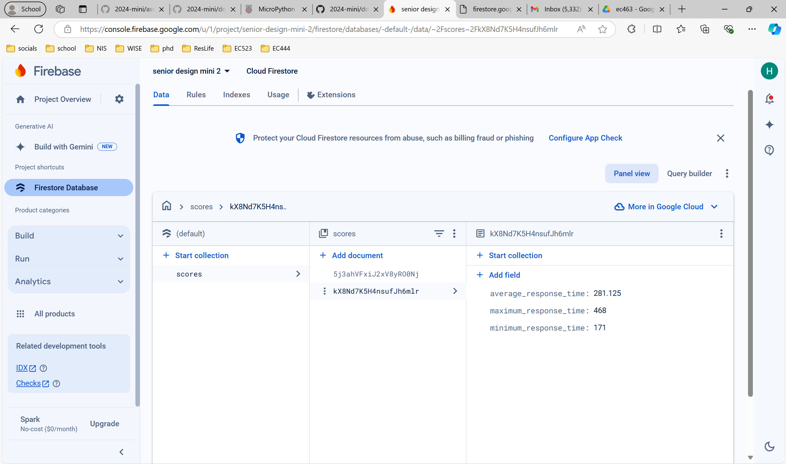
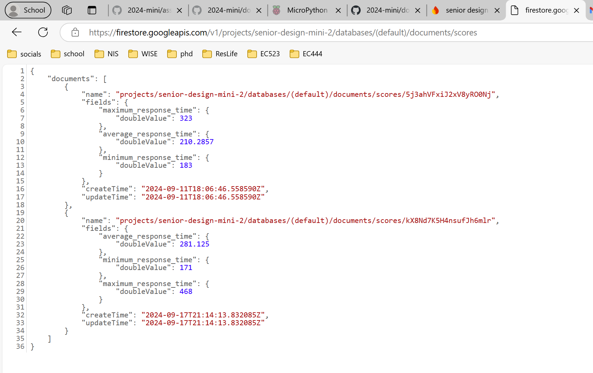

# EC463 2024 Miniproject
Howell Xia and Harlan Jones

## Exercise 1: Light
The values we found for max_bright and min_bright were 5500 and 38000, respectively.

## Exercise 3: Game

### Game data
Average response time: 210.2857ms  
Minimum response time: 183ms  
Maximum response time: 323ms  

### Cloud portion
Our data is uploaded via an HTTP request from the Pico in our `exercise_game.py` script to a Firebase project. The HTTP request url is [here](https://firestore.googleapis.com/v1/projects/senior-design-mini-2/databases/(default)/documents/scores) and the project link is [here](https://console.firebase.google.com/project/1015684280757). The project is private but we've shared it with all the BU emails of the professors and GSTs. Below are screenshots of the cloud storage.

Firebase Database

 

HTTP URL

